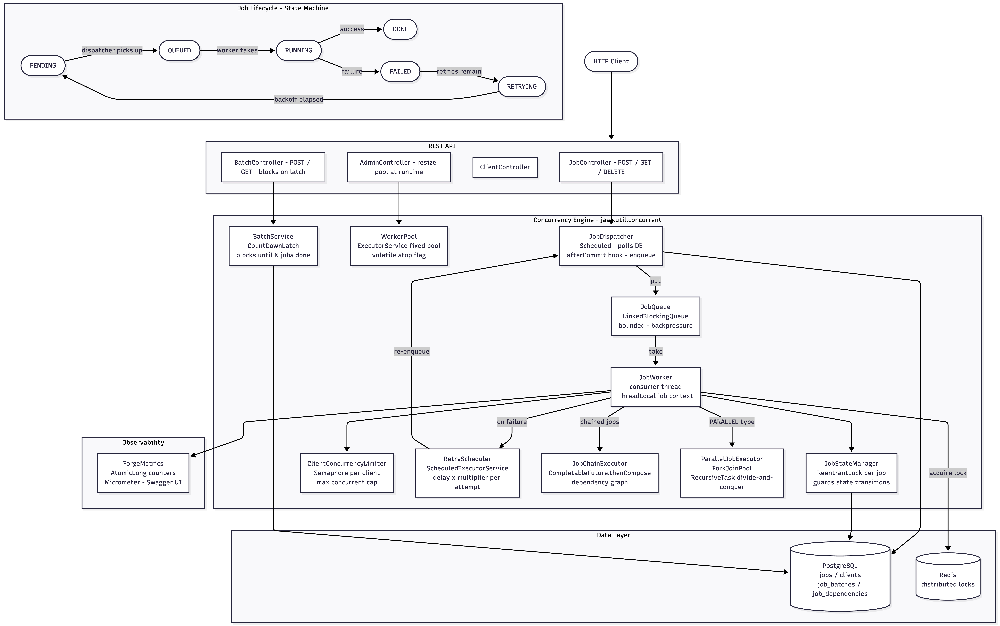

# Forge — Distributed Job Processing Engine

A production-grade distributed job processing engine built with **Java 21** and **Spring Boot 3**. Forge lets clients submit jobs via REST, queues them in a bounded in-memory queue, executes them with a configurable thread pool, enforces per-client concurrency limits, supports job chaining, retries with exponential backoff, and exposes real-time status tracking.

Think self-hosted Sidekiq or Celery, built from scratch to demonstrate every primitive in `java.util.concurrent`.

## Architecture



---

## Concurrency Map

Every thread primitive used in this project is intentional.

| Primitive | Where | Why |
|---|---|---|
| `ExecutorService` (fixed pool) | `WorkerPool` | N worker threads execute jobs concurrently |
| `BlockingQueue` (bounded) | `JobQueue` | Back-pressure: producer blocks when workers are saturated, preventing unbounded memory growth |
| Producer-Consumer | `JobDispatcher` → `JobQueue` → `JobWorker` | HTTP threads submit; background threads execute; the queue decouples them |
| `ReentrantLock` | `JobStateManager` | Per-job locks guard state transitions (PENDING → RUNNING → DONE) against races |
| `CountDownLatch` | `BatchService` | `GET /batches/{id}` blocks until all N jobs in the batch call `countDown()` |
| `Semaphore` | `ClientConcurrencyLimiter` | Each client gets a semaphore(maxConcurrentJobs); the 3rd job waits when 2 are already running |
| `CompletableFuture` | `JobChainExecutor` | Job B starts only after Job A completes; chains built via `thenCompose` |
| `AtomicLong` | `ForgeMetrics` | Lock-free counters for throughput metrics — no `synchronized` needed |
| `volatile` | `WorkerPool.running` | One writer (main thread), many readers (workers) — `volatile` is the right tool, not `AtomicBoolean` |
| `ScheduledExecutorService` | `RetryScheduler` | Failed jobs re-enqueued after exponential backoff (delay × multiplier^attempt) |
| `ThreadLocal` | `JobContext` | Each worker stores the current job ID so MDC logging works without passing it through every call |
| `ForkJoinPool` | `ParallelJobExecutor` | `PARALLEL` jobs split their payload into halves via `RecursiveTask`, exploiting all available cores |

---

## Tech Stack

| Layer | Technology |
|---|---|
| Language | Java 21 |
| Framework | Spring Boot 3.3 |
| Database | PostgreSQL 16 |
| Cache / Locks | Redis 7 |
| Migrations | Flyway |
| Metrics | Micrometer |
| API Docs | SpringDoc OpenAPI (Swagger UI) |
| Testing | JUnit 5 + Testcontainers |

Service ports:

| Service | Port |
|---|---|
| Forge API | 8082 |
| PostgreSQL | 5434 |
| Redis | 6381 |

---

## Quick Start

```bash
# 1. Start infrastructure
docker compose up -d

# 2. Run the application
./mvnw spring-boot:run

# 3. Open Swagger UI
open http://localhost:8082/swagger-ui.html
```

---

## API Reference

### Jobs

| Method | Path | Description |
|---|---|---|
| `POST` | `/jobs` | Submit a job |
| `GET` | `/jobs/{id}` | Get job status and result |
| `GET` | `/jobs?clientId=&status=&page=&size=` | List jobs with optional filters |
| `DELETE` | `/jobs/{id}` | Cancel a PENDING job |

**Submit a job:**
```json
POST /jobs
{
  "clientId": "uuid",
  "type": "EMAIL",
  "payload": "{}",
  "priority": 0,
  "maxRetries": 3,
  "dependsOn": []
}
```

**Job types:** `EMAIL` (100ms), `REPORT` (500ms), `SLOW` (configurable), `PARALLEL` (ForkJoin, JSON array payload), `DATA_EXPORT`

**Job statuses:** `PENDING → QUEUED → RUNNING → DONE | FAILED → RETRYING → PENDING`

---

### Batches

| Method | Path | Description |
|---|---|---|
| `POST` | `/batches` | Submit N jobs as a batch |
| `GET` | `/batches/{id}` | Get batch progress — **blocks until all jobs finish** (CountDownLatch) |
| `GET` | `/batches/{id}/jobs` | List individual jobs in the batch |

---

### Clients

| Method | Path | Description |
|---|---|---|
| `POST` | `/clients` | Register a client |
| `GET` | `/clients/{id}` | Get client info |
| `GET` | `/clients/{id}/stats` | Jobs submitted / done / failed, avg latency |

---

### Admin

| Method | Path | Description |
|---|---|---|
| `GET` | `/admin/workers` | Pool size, active threads, queue depth, metrics |
| `POST` | `/admin/workers/resize?poolSize=` | Resize the thread pool at runtime |

---

## Architecture

```
api/
  controller/         REST endpoints (Job, Client, Batch, Worker)
  dto/                Request/Response objects (Builder pattern)

application/
  service/            JobService, ClientService, BatchService
  worker/
    WorkerPool        Owns the ExecutorService; start/stop/resize
    JobQueue          Wrapper around LinkedBlockingQueue<Job>
    JobDispatcher     @Scheduled producer: polls DB → puts onto queue
    JobWorker         Consumer: takes from queue → executes → updates state
    JobStateManager   ReentrantLock-guarded state machine
    ClientConcurrencyLimiter  Semaphore per client
    RetryScheduler    ScheduledExecutorService with exponential backoff
    JobChainExecutor  CompletableFuture dependency graph resolution
    StartupRecovery   Resets QUEUED orphans to PENDING on restart
  metrics/            AtomicLong counters via Micrometer

domain/
  model/              Job, Client, JobBatch (JPA entities)
  repository/         IJobRepository, IClientRepository, IJobBatchRepository
  executor/           JobExecutor strategy interface + JobExecutorRegistry

infrastructure/
  persistence/        JPA repository implementations
  executor/           EmailJobExecutor, ParallelJobExecutor, SlowJobExecutor
  config/             WorkerConfig, RedisConfig, OpenApiConfig

shared/
  context/            JobContext (ThreadLocal<UUID> for MDC)
  exception/          JobNotFoundException, ClientNotFoundException, etc.
```

**Layer rules:**
- `domain/` — zero Spring/JPA/Redis imports
- `application/` — `@Service`, `@Transactional` allowed; no JPA/Redis directly
- All `java.util.concurrent` primitives live in `application/worker/`

---

## Database Schema

```sql
clients          id, name, api_key, max_concurrent_jobs, created_at
jobs             id, client_id, batch_id, type, payload (JSONB), status,
                 priority, retry_count, max_retries, result, error_message,
                 created_at, started_at, completed_at, scheduled_after
job_batches      id, client_id, name, total_jobs, completed_jobs,
                 failed_jobs, status, created_at, completed_at
job_dependencies job_id, depends_on_job_id
```

---

## Key Design Decisions

**Why `afterCommit()` for queue enqueue?**
`JobDispatcher.dispatch()` is `@Transactional`. Putting jobs on the in-memory queue *inside* the transaction means a worker can pick up a job and call `markRunning` before `markQueued` is visible to other transactions. The fix: register a `TransactionSynchronization.afterCommit()` hook so jobs reach the queue only after the DB write commits.

**Why `CountDownLatch` over polling for batches?**
`GET /batches/{id}` needs to block until the batch completes. A latch avoids polling loops entirely — the HTTP thread sleeps for free until the last `jobFinished` call fires `countDown()`. The latch countdown also lives in an `afterCommit()` hook to ensure the batch record is fully written before the waiting thread unblocks.

**Why `volatile` instead of `AtomicBoolean` for the stop flag?**
`WorkerPool.running` has exactly one writer (the main thread calling `stop()`) and many readers (worker threads in `while (isRunning())`). No compare-and-swap is needed. `volatile` provides the required visibility guarantee at lower overhead.

**Why `ForkJoinPool.commonPool()` for parallel jobs?**
`PARALLEL` jobs use divide-and-conquer via `RecursiveTask`. The ForkJoin work-stealing scheduler is purpose-built for this pattern — idle worker threads steal subtasks from busy threads' deques, which keeps all cores busy without manual thread management.

---

## Running Tests

```bash
# All tests (unit + integration via Testcontainers)
./mvnw test

# Single test class
./mvnw test -Dtest=JobLifecycleIntegrationTest

# Skip tests
./mvnw clean package -DskipTests
```

Integration tests spin up real PostgreSQL 16 and Redis 7 containers via Testcontainers — no manual setup needed beyond a running Docker daemon.

---

## Configuration

| Property | Default | Description |
|---|---|---|
| `forge.dispatcher.interval-ms` | `1000` | How often the dispatcher polls for pending jobs |
| `forge.worker.pool-size` | `4` | Number of worker threads |
| `forge.worker.queue-capacity` | `100` | Bounded queue depth (back-pressure threshold) |
| `forge.retry.initial-delay-ms` | `1000` | Base retry delay |
| `forge.retry.backoff-multiplier` | `2.0` | Exponential backoff multiplier |
